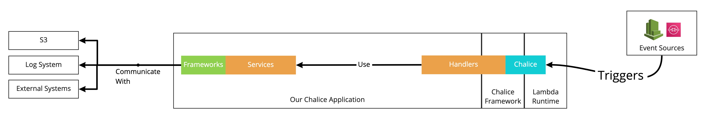
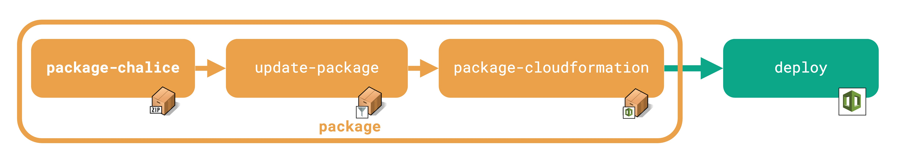

# AWS Chalice Demo

This is a demo project, illustrating how to make use of AWS Chalice with AWS to perform ETL.

## Requirements
  * Periodically check to see which records are in the 'submit' state
  * Take these records & create SQS message
  * Process numerous messages from the queue via another lambda
  * Create required infrastructure (queue, etc)

## References
 * [Homebrew](https://brew.sh/)
 * [Chalice](https://github.com/aws/chalice)
 * [Pyenv](https://github.com/pyenv/pyenv)


<div style="clear:right">&nbsp;</div>

## Logical Architecture



## Testing
 * Just execute the tests
```sh
make test
```

 * Execute Tests & Coverage (simple report)
```sh
make test-cov-report
```

 * Execute the tests & produce HTML coverage report
```sh
make test-cov-html
```

## Deployment & AWS
This project makes use of [AWS Chalice](https://aws.github.io/chalice/index.html) to eliminate a lot of the boilerplate for creating lambdas.



Since most of the AWS libries that are typically used require boto3, AND boto3 is included by default within a lambda's runtime AND we need a small package size to deploy, we need to perform some "post-processing" of the lambda zip package when deploying. (we manually remove the boto3 library from the zip).

We have to reduce the package size before deploy, and the only way to do that is to deploy via CloudFormation in a 3 step process.
```sh
make package-chalice # Package the Python Code & ALL libraries
make update-package # Remove Botocore & others (reduce size)
make package-cloudformation # Create the CloudFormation Package & Upload to S3
make deploy # Deploy to AWS
```
OR, just run the chained commands:
```sh
make package ## Executes package-chalice, update-package & package-cloudformation
make deploy 
```


## Python VirtualEnv
The following tools are used to manage python versions & virtual environments. Make sure these are installed.
 * [pyenv](https://github.com/pyenv/pyenv) -- Used to Manage Python Versions
 * [pyenv-virtualenv](https://github.com/pyenv/pyenv-virtualenv) -- Connects Pyenv & traditional virtualenvs

### Create VirtualEnv
This only needs to be done once
```sh
pyenv virtualenv 3.9.2 <project-name>
```

### Activate VirtualEnv
```sh
pyenv activate <project-name>
```

### Using The VirtualEnv
Typical tasks would be:
 * Install dependencies via pip
  ```sh
  pyenv exec pip install <something>
  ```
 * Execute python scripts
  ```sh
  pyenv exec python ./some-file.py
  ```
 